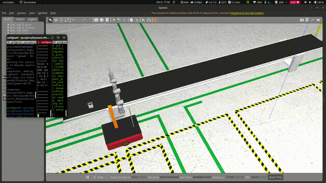
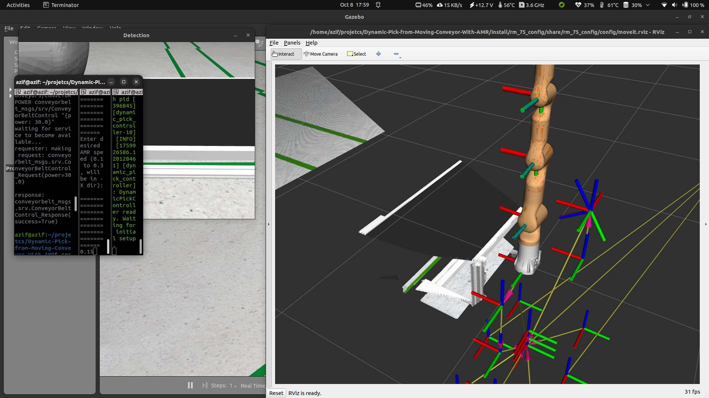
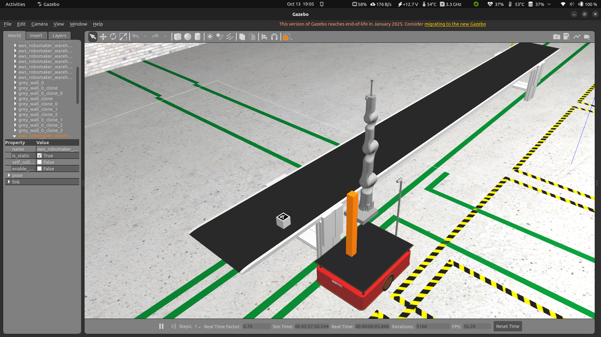
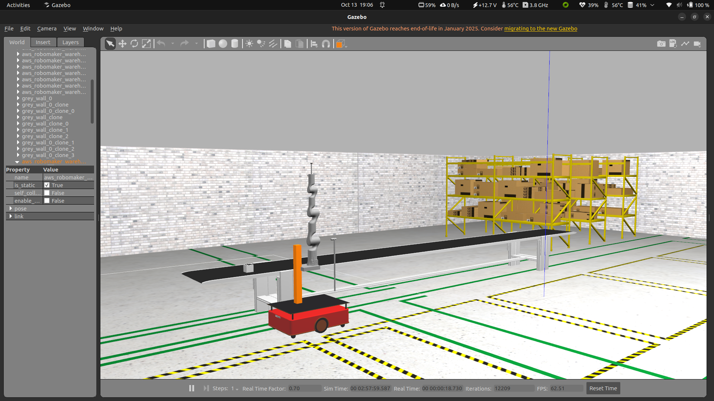

# 🤖 Dynamic Pick from Moving Conveyor While AMR

<div align="center">
  
</div>

## 🏗️ Overview

This repository demonstrates a **ROS 2 Humble simulation** of a **dynamic pick operation** where both the target (a box) and the robot (AMR with robotic arm) are moving simultaneously.  

The robot navigates alongside a **moving conveyor belt** while performing a precise **pick operation** using vision (ArUco markers) and a **7-DOF RealMan arm**.

---

## 📁 Repository Structure

```bash
Dynamic-Pick-from-Moving-Conveyor-With-AMR/
│
├── alphabot_description/           # AMR URDFs, meshes, and configs
├── rm_bringup/                     # RealMan manipulator bringup
├── custom_robots/                  # Gazebo world & robot spawn
├── mobile_manipulator_bringup/     # MoveIt 2 bringup for arm
├── pipeline_manipulator/           # FSM and perception pipeline
├── conveyor_plugin/                # Gazebo conveyor control plugin
├── gif/                            # Simulation demo GIFs & screenshots
└── README.md
````

---

## ⚙️ Requirements

* Ubuntu 22.04
* ROS 2 Humble
* Gazebo 11
* MoveIt 2
* Nav2 (for optional AMR navigation)
* `teleop_twist_keyboard` (optional manual control)
* SQLite / MySQL (for logging, optional)

---

## 🧩 Environment Setup

Make sure Gazebo can find all models and plugins:

```bash
export GAZEBO_PLUGIN_PATH=$HOME/projetcs/Dynamic-Pick-from-Moving-Conveyor-With-AMR/install/conveyor_plugin/lib:$GAZEBO_PLUGIN_PATH
```

---

## 🚀 Launch Instructions

### 1️⃣ Launch Full Mobile Manipulator Simulation

```bash
ros2 launch mobile_manipulator_bringup bringup_mobile_manipulator.launch.py
```

This loads **Gazebo** with the AMR, manipulator, and moving conveyor.

### 2️⃣ Run the Pipeline / FSM (Dynamic Pick)

```bash
ros2 run pipeline_manipulator pipeline_fsm
```

You will see:

```
[INFO] [pipeline_fsm]: Waiting for conveyor service...
[INFO] [pipeline_fsm]: Conveyor service ready. Starting pipeline logic.
=======================================================
Enter desired AMR speed (0.1 to 0.3, will be in -X dir): 
=======================================================
```

---

## 🎮 Optional Utilities

**Move AMR manually along X axis:**

```bash
ros2 topic pub /cmd_vel geometry_msgs/msg/Twist "{linear: {x: -0.2, y: 0.0, z: 0.0}, angular: {x: 0.0, y: 0.0, z: 0.0}}"
```

**Start Conveyor Belt:**

```bash
ros2 service call /conveyor3/CONVEYORPOWER conveyorbelt_msgs/srv/ConveyorBeltControl "{power: 10.0}"
```

---

## 🧠 System Workflow

1. **Pipeline FSM** initializes.
2. **Camera detects** ArUco marker on the moving box.
3. **Manipulator tracks and picks** the box while both the AMR and conveyor are in motion.
4. **Continuous adjustment** in Cartesian space for arm motion.
5. Logging of task data in database for analysis.

---

## 🧱 Core Features

✅ Dynamic pick from moving conveyor
✅ Real-time ArUco vision tracking
✅ 7-DOF manipulator operation in motion
✅ Conveyor plugin simulation
✅ AMR speed adjustment
✅ RViz visualization for alignment and grasp

---

## 📸 Simulation Demos

| Description         | Preview                                 |
| ------------------- | --------------------------------------- |
| Full Pick Operation |  |
| Conveyor in Motion  |  |
| image 1        |       |
| image 2        |       |
| image 3        |       |

---

## 🔧 Future Enhancements

* Parameterize AMR and conveyor speed for testing
* Add advanced motion prediction for the arm
* Integrate multiple objects on the conveyor
* Add automated database analytics

---

## 👨‍💻 Author

**Mohammed Azif**
📧 [syedazif321@gmail.com](mailto:syedazif321@gmail.com)
🔗 [GitHub Profile](https://github.com/syedazif321)

---

## 🧾 License

Released under the **MIT License**.


